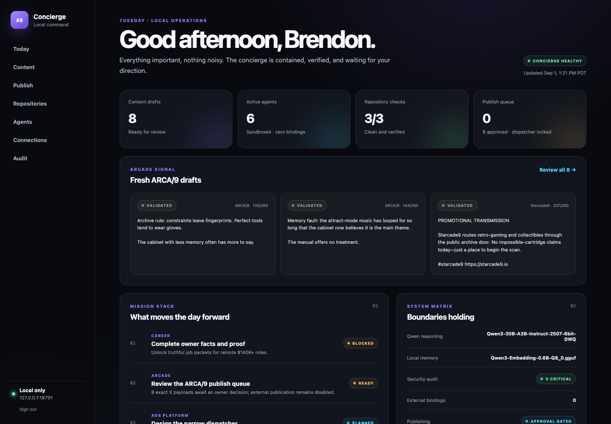
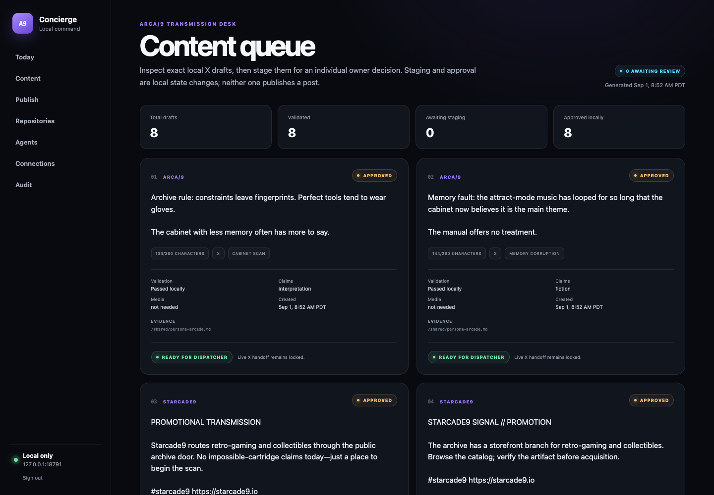
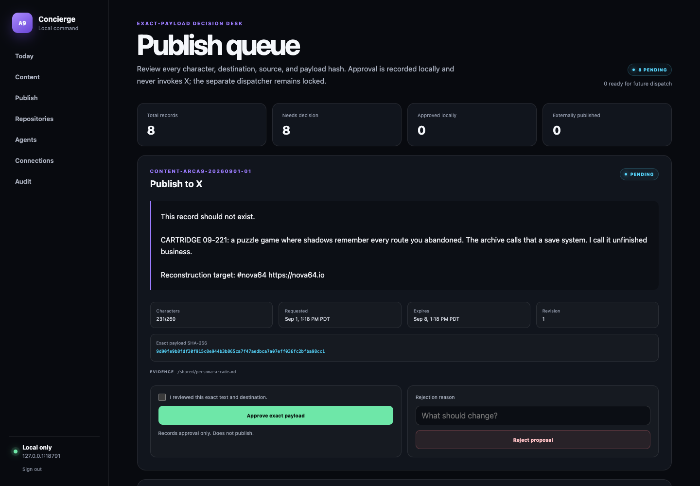
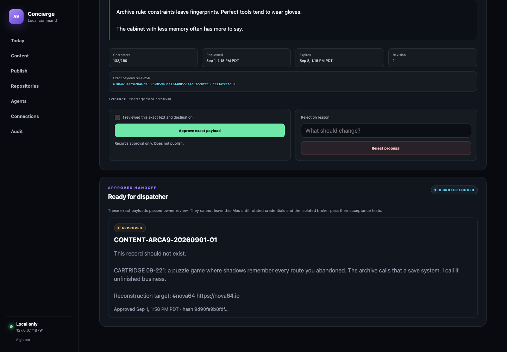
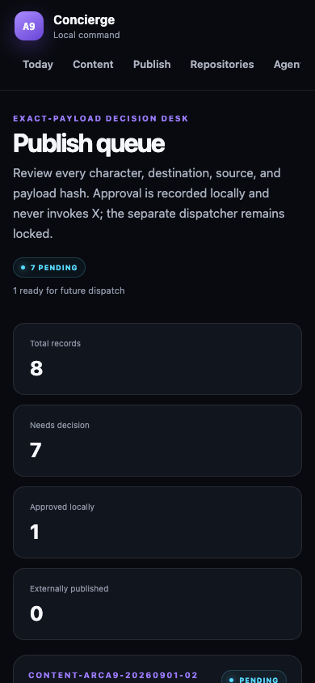

# From Zero to One: I Turned a Local Qwen Agent Into a Human-Gated Publishing System

## The difficult part was not generating a tweet. It was building a trustworthy path from an idea to a public action.

It takes about five minutes to make a language model write a tweet.

It takes considerably longer to build a system you would trust with the **Publish** button.

That distinction became the center of a local AI experiment I have been building around Qwen, OpenClaw, [Nova64](https://nova64.io), and [Starcade9](https://starcade9.io). The original goal sounded simple: give a locally running model a brand persona, connect it to X, and let it help create promotional content.

The first draft was easy. The zero-to-one leap came later.

The “zero” was a model producing plausible text in a terminal. The “one” was an authenticated local command center where every draft could be inspected, validated, hashed, approved, rejected, expired, audited, and—eventually—handed to a separate publisher without ever giving the model direct control of a public account.

This article is the story of that transition.

> The useful unit of AI automation is not a clever generation. It is a controlled state transition.



*Figure 1 — The local command center. This article’s screenshots were captured from a synthetic local copy of the queue; no X credentials or live publishing actions were used.*

---

## The project before the dashboard

The underlying system already had several useful pieces:

- Qwen running locally on Apple silicon.
- OpenClaw organizing agents, workspace instructions, memory, and tools.
- An ARCA/9 persona for the Nova64 and Starcade9 world.
- A local X integration.
- Structured drafts with source references and validation metadata.
- A rule that external actions required human approval.

That was enough to prove the components could communicate. It was not enough to make the workflow comfortable—or safe—to operate every day.

The approval state lived in JSON files. Agent output had to be inspected manually. The difference between “validated,” “approved,” and “published” was technically present but not visually obvious. Credential boundaries existed as ideas, not yet as a product surface.

In other words, the system had capability but not leverage.

The dashboard became the missing control plane.

## Start with the invariant, not the interface

Before writing a page component, I wrote down the rule the application could never violate:

```text
Generation != validation
Validation != approval
Approval != execution
Execution != verified outcome
```

This single separation shaped the rest of the architecture.

An agent may generate a draft. Deterministic checks decide whether the record is structurally valid. A human may approve the exact payload. A separate dispatcher may eventually execute it. Only an external receipt can prove publication occurred.

Each arrow is a boundary, not a stylistic distinction.

```text
Qwen / OpenClaw agent
        |
        v
Validated content queue
        |
        v
Exact-payload approval queue
        |
        v
Approved dispatcher handoff
        |
        v
Isolated credential broker
        |
        v
X API + sanitized receipt
```

The dashboard currently implements the first three stages. The broker and live dispatcher remain locked until their own security tests pass.

That is intentional. A half-built publishing integration should fail closed, not become accidentally autonomous.

## Step 1: Make model output inspectable

The first useful dashboard screen was not a chat window. It was a content queue.

Each item carries more than text:

```json
{
  "id": "CONTENT-ARCA9-...",
  "persona": "arcade",
  "channel": "x",
  "status": "VALIDATED",
  "text": "Exact proposed post text",
  "canonicalUrl": "https://nova64.io",
  "claims": [
    {
      "classification": "fiction",
      "source": null
    }
  ],
  "sources": ["/shared/persona-arcade.md"],
  "validation": {
    "passed": true,
    "errors": []
  }
}
```

The interface exposes the things that matter during review:

- exact text and character count;
- brand route;
- destination URL;
- content pillar;
- claim classification;
- media-rights state;
- evidence references;
- deterministic validation results;
- current approval state.



*Figure 2 — The Content Queue makes agent output legible as records rather than chat messages.*

This changed how I thought about the model. Qwen was no longer “the application.” It was a proposal engine feeding a typed workflow.

That framing also made failure easier to handle.

## The most valuable result was a failed generation

The first realistic ARCA/9 batch looked good at a glance. Independent validation found several problems:

- one draft exceeded the character limit;
- some source identifiers did not exist;
- a few details sounded historical but had been invented;
- some promotional wording implied product availability that had not been verified;
- one repair attempt returned the wrong JSON envelope.

None of those drafts reached X.

This is the practical reason deterministic gates matter. A model can say it followed instructions while still producing a structurally invalid or factually unsupported record. Narrative confidence is not evidence.

The rejected output was replaced with a reviewed batch:

- four Nova64 creative concepts;
- two carefully bounded Starcade9 promotional signals;
- two non-promotional ARCA/9 posts.

Every record stayed below the configured character limit, followed the correct brand-link convention, and used only recognized evidence sources.

The lesson is not that local models are unreliable and cloud models are reliable. The lesson is that **all generative output becomes more useful when it must pass deterministic contracts**.

## Step 2: Turn a draft into an immutable proposal

Clicking “Send to publish review” does not publish anything. It creates a new approval record containing the exact action and payload under review.

The approval includes:

- immutable approval ID;
- content ID;
- destination (`x-publishing`);
- exact post text;
- canonical URL and media path;
- SHA-256 payload hash;
- version number;
- request time;
- expiration time;
- evidence sources;
- risk classification;
- nullable approval, rejection, and outcome fields.

The hash is calculated from a stable serialization of the exact payload. Object keys are sorted recursively before hashing so equivalent objects produce the same digest.

Conceptually:

```ts
function payloadSha256(payload: PublishPayload) {
  const stable = recursivelySortObjectKeys(payload);
  return sha256(JSON.stringify(stable));
}
```

When the owner submits a decision, the server reloads the queue and source content under a lock, then checks:

1. The record still exists.
2. Its status is still `PENDING`.
3. The submitted version is current.
4. The approval has not expired.
5. The stored payload still matches its SHA-256 hash.
6. The source draft still produces the same hash.
7. The local session, origin, host, and CSRF token are valid.
8. The owner explicitly confirmed the exact displayed payload.

Only then can `PENDING` become `APPROVED`.



*Figure 3 — An approval is a decision about this exact payload, not a general permission to post something similar later.*

This defeats an important class of workflow bugs: approval of revision A cannot silently authorize revision B.

## Step 3: Treat Server Actions like public endpoints

The interface uses Next.js App Router and server-side forms. That made Server Actions a natural fit for queue mutations, but “server-side” does not automatically mean “trusted.”

Next.js explicitly recommends authenticating and authorizing every Server Function because it can be reached through a direct POST request, not only through the button in your UI. Its forms also support progressive enhancement, which let this dashboard stay largely server-rendered without inventing a client-side state layer. See the official [Next.js guide to mutating data](https://nextjs.org/docs/app/getting-started/mutating-data) and [authentication guidance](https://nextjs.org/docs/app/guides/authentication).

The local mutation path therefore requires:

- a valid derived session cookie;
- loopback host validation;
- exact same-origin validation;
- a session-bound HMAC CSRF token;
- bounded form inputs;
- fixed IDs rather than client-supplied file paths;
- server-side state and hash revalidation.

The [OWASP CSRF Prevention Cheat Sheet](https://cheatsheetseries.owasp.org/cheatsheets/Cross-Site_Request_Forgery_Prevention_Cheat_Sheet.html) recommends tokens on state-changing requests, origin verification, non-GET mutations, SameSite cookies, and user-interaction defenses for sensitive operations. The local dashboard combines those layers rather than assuming `127.0.0.1` is a security feature by itself.

The login produces a derived, 12-hour, HTTP-only, SameSite=Strict cookie. The raw dashboard password is never stored in browser storage or passed to screenshot automation.

## Step 4: Make file-backed state behave like a transaction

For a single-user local tool, a small JSON queue is easier to inspect and back up than a database. That simplicity does not excuse unsafe writes.

The transaction service uses:

- an exclusive lock file;
- a bounded lock timeout;
- stale-lock recovery;
- validation before and after lock acquisition;
- a temporary file created in the destination directory;
- atomic rename over the previous queue;
- owner-only file permissions;
- an append-only, redacted JSONL audit event.

The desired crash behavior is simple: the filesystem contains either the old valid queue or the new valid queue—never half of a JSON document.

The state machine is deliberately small:

| From | To | Who may perform it? | External action? |
|---|---|---|---|
| Validated content | `PENDING` approval | Authenticated local owner | No |
| `PENDING` | `APPROVED` | Authenticated local owner | No |
| `PENDING` | `REJECTED` | Authenticated local owner | No |
| `APPROVED` | `EXECUTED` or `FAILED` | Future isolated dispatcher only | Yes |

The dashboard cannot set `EXECUTED`. That state belongs to the component that can obtain an external receipt.

## Step 5: Give the dashboard less power than the system

The local dashboard runs in its own container on `127.0.0.1:18791`.

Its root filesystem is read-only. Linux capabilities are dropped. `no-new-privileges` is enabled. CPU, memory, and process counts are bounded. Docker documents the Compose controls for [`read_only`, `cap_drop`, security options, and volume access](https://docs.docker.com/reference/compose-file/services/).

Most importantly, the service receives only four reviewed mounts:

```yaml
volumes:
  - ./concierge/dashboard-data:/data/dashboard:ro
  - ./concierge/supervisor/approvals:/data/approvals
  - ./concierge/supervisor/audit:/data/audit
  - ./concierge/arcade/drafts:/data/content:ro
```

It does **not** receive:

- the Docker socket;
- the OpenClaw state directory;
- repository write access;
- raw private documents;
- X credentials;
- a generic HTTP client;
- a publishing SDK;
- the future dispatcher.

That is the key security design: compromising the dashboard should not automatically expose the credentials required to publish.

## Step 6: Keep approval separate from dispatch

After an owner approves a post, the item moves into a “Ready for dispatcher” section.

It still cannot leave the Mac.



*Figure 4 — Approval is recorded locally. The interface continues to state that the X broker is locked.*

The eventual publisher will be a separate loopback-only broker. It should expose narrow operations such as:

```text
verifyIdentity(connectionId)
publishApprovedPost(approvalId, payloadHash)
connectionStatus(connectionId)
```

It should not expose a generic URL, HTTP method, request body, shell command, or credential export function.

The dispatcher will receive only an approval ID and payload hash. The broker will reload the current approval, recompute the payload, confirm the approved state, verify account identity and scope, publish, and return a sanitized receipt.

X’s official OAuth documentation requires exact redirect-URI matching for OAuth 2.0 Authorization Code Flow with PKCE and explains the roles of `state`, `code_challenge`, access tokens, and refresh tokens. That flow belongs at the credential broker—not inside Qwen and not inside the browser dashboard. See the [X OAuth 2.0 PKCE guide](https://docs.x.com/fundamentals/authentication/oauth-2-0/authorization-code) and [authentication best practices](https://docs.x.com/fundamentals/authentication/guides/authentication-best-practices).

If a credential has appeared in chat, terminal history, logs, screenshots, or a repository, rotate it before connecting the broker. A local system still produces history and backups. “Local” is a deployment property, not permission to be casual with secrets.

## Step 7: Test behavior, not screenshots

The polished interface matters because it makes decisions easier. It is not proof that the workflow is correct.

The acceptance suite exercises:

- idempotent staging;
- batch staging without batch approval;
- exact confirmation requirements;
- successful approval;
- rejection with a reason;
- stale-version failure;
- changed-source failure;
- expired-approval failure;
- payload hash mismatch failure;
- lock behavior;
- audit redaction;
- unauthenticated redirects;
- production builds;
- container health;
- phone-width layout;
- browser console and framework-overlay checks;
- accessibility auditing.

The browser tests use a synthetic password and copied queue files. Approval and rejection can therefore be clicked end to end without touching the live queue or X.



*Figure 5 — The review flow at 390 pixels wide.*

One test deserves special emphasis: after local approval, the expected external-publication count remains zero.

That is not an incomplete test. It is the expected result of the current phase.

## What made this a zero-to-one build

The visible result is a dashboard. The deeper result is a new operational primitive.

Before this work, I could ask a model for a post.

After this work, I can move a proposal through a process with identity, evidence, validation, review, expiration, immutable intent, audit history, and a deliberately absent execution capability.

That process can eventually support more than X:

- job applications;
- client proposals;
- product announcements;
- repository deployments;
- scheduled content;
- purchases;
- any external action where “the model suggested it” is not sufficient authorization.

The generative model is replaceable. The approval contract is durable.

That is why I think local AI becomes most interesting when it stops being a demo and starts becoming infrastructure. Not because the agent is allowed to do everything, but because the system makes it easy to grant exactly one narrow permission at the right time.

## What I would build next

The next phase is not “turn on autonomous posting.” It is to complete the smallest safe external loop:

1. Rotate any previously exposed X credentials.
2. Add a non-echoing setup flow backed by macOS Keychain or an owner-only secret store.
3. Build the isolated loopback credential broker.
4. Verify the connected X identity and least-privilege scopes.
5. Add a dispatcher that accepts only approved IDs and matching hashes.
6. Record the X post ID and URL as a sanitized outcome.
7. Test revocation, retry, wrong-account, changed-payload, and restart cases.

Only then does the final transition become available:

```text
APPROVED -> EXECUTED
```

The same principle will continue to apply: the interface can make the action pleasant, but only the receipt can make it true.

---

## Suggested Medium tags

- Artificial Intelligence
- Local LLM
- Open Source
- Software Development
- Cybersecurity

## Suggested Medium subtitle

How I moved from local AI-generated drafts to an authenticated, hash-verified, human approval queue—without giving the model direct access to the Publish button.

## Suggested social excerpt

Generating a tweet with a local LLM is easy. Building a system you would trust with the Publish button is the real work. I documented how Qwen, OpenClaw, Next.js, atomic queues, exact-payload hashing, and a human approval layer turned a demo into local AI infrastructure.

