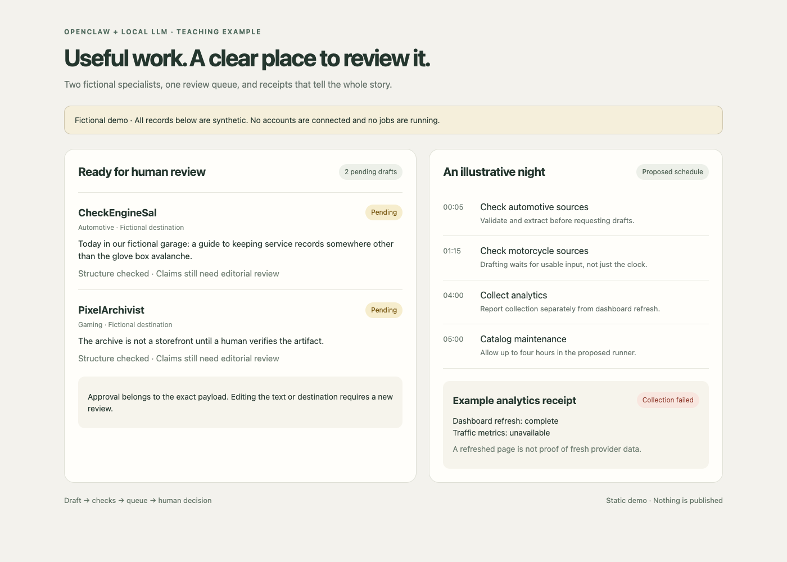

# From One Queue to a Local Command Center: Building an OpenClaw + Qwen Dashboard

## Part 2: Giving local agents useful jobs, clear handoffs, and somewhere to put the paperwork

In Part 1, I built a local publishing workflow around Qwen and OpenClaw. A model could draft something, a person could inspect it, and an approval referred to the exact text being reviewed.

Then I added more jobs.

A second persona needed its own queue. Several websites needed checks. Analytics needed somewhere to report. Overnight tasks needed a schedule. Before long, I was checking enough JSON files to qualify for a modest administrative position.

The dashboard grew out of that problem. I wanted one place to see what the agents had prepared, what had passed its checks, and what still needed my attention.

The architecture comes from the project we are building. The walkthrough uses fictional personas and illustrative records. CheckEngineSal is our automotive example. PixelArchivist handles the gaming examples. These are teaching names, not references to anyone's social accounts.

## What the agents actually automate

Imagine a small automotive reference site. Each morning, someone checks source material, selects useful topics, writes short posts, verifies the supporting claims, and puts the results in a review queue.

An agent can take on the reading and drafting portions. A script can check required fields, enforce the destination, and write a receipt. A scheduler can start that work at an agreed time. The dashboard can collect the results into a view the owner can review over coffee.

The intended flow looks like this:

```text
Source material
↓
Agent selects a topic and drafts a post
↓
Validation checks the record and its evidence
↓
The draft enters the correct review queue
↓
The owner reviews the proposed action
↓
An authorized dispatcher can act and record the outcome
```

Qwen supplies the language model. OpenClaw provides the agent runtime and workspace context. Our application code supplies the queue rules, validation, and reporting.

That division makes the automation easier to understand. Generating a useful paragraph is a language task. Comparing two account destinations is a rule. I do not need a model to have an opinion about whether two strings match.

This is the workflow we are developing toward. Parts already exist locally, including specialist queues and dashboard projections. Other parts, particularly unattended repository execution and external messaging, still need their operational wiring completed.

## CheckEngineSal gets a desk

For our fictional automotive agent, the job is deliberately specific: prepare short, sourced drafts about vehicle ownership for a human editor.

Sal can read reviewed material, identify a useful angle, and draft a post in a practical voice. He should be comfortable saying that a detail needs verification. A confident guess about a recall is still a guess, even if it arrives wearing coveralls.

PixelArchivist has a different assignment and a different voice. The two agents may use the same local model service while receiving different instructions and context.

The dashboard brings their work together for review. Their destinations remain distinct.

```json
{
  "persona": "automotive",
  "channel": "demo",
  "targetAccount": "CheckEngineSal",
  "status": "VALIDATED"
}
```

In this example, the destination is a fictional label. A deployed service would resolve its own reviewed account configuration separately.

The label belongs in the proposed payload because the destination is part of the editorial decision. An automotive post turning up in a gaming feed is a routing defect, even if the engine does sound like an arcade cabinet.

## A shared view without shared confusion

The content view combines drafts from several specialists. Each record shows the authoring persona, intended destination, text, evidence, validation result, and review state.

That answers the questions I actually have when opening the dashboard:

1. Who prepared this?
2. What is the proposed post?
3. Where would it go?
4. What supports it?
5. What decision does it need from me?



Figure 1: A browser capture of the companion demo. All names, counts, drafts, and job results are illustrative. This image demonstrates the layout and is not a live operations report.

The projection gives the dashboard a limited view of the underlying system. It contains the information needed for review, while provider credentials stay elsewhere.

The application may expose specific local review actions. Those actions still need to check the current source record and the exact payload. A pleasant interface does not remove the need for those checks. It just makes the paperwork less hostile.

## A schedule needs an actual runner

A schedule card is useful for planning. To automate the work, something must also launch the command, apply a timeout, collect the result, and make it available to the next task.

For a hypothetical daily workflow, I might plan:

1. At 00:05, validate the automotive source pages.
2. At 01:15, validate motorcycle material.
3. After both feeds pass, ask CheckEngineSal to prepare review drafts.
4. Refresh the dashboard after those drafts are written.
5. At 04:00, collect analytics.
6. At 05:00, allow a longer catalog task up to four hours.

Dependencies need enforcement, not just a convenient arrangement of clock times. If a feed fails, the drafting task should record that it could not proceed with fresh material. If analytics overruns, a task that shares its execution lock should wait or be skipped according to an explicit rule.

A long catalog build deserves a realistic time allowance. It also deserves progress logs and a timeout that stops its child processes. “It takes a while” is useful context, but a difficult status to put on a dashboard.

In our project, a four hour slot was added to the plan for the long build. That change described the intended budget. It did not install a runner or demonstrate a successful overnight run.

## Receipts tell us what happened

A receipt records the outcome of a particular operation. The scope of that operation matters.

During development, we saw a wrapper finish successfully while the analytics report recorded failed collection. The dashboard had refreshed, but the site metrics were unavailable.

That exposed a reporting weakness. A single COMPLETE label could sound broader than the work it actually proved.

For a future receipt, I would separate the stages explicitly:

```json
{
  "task": "dailyAnalyticsDemo",
  "runnerStatus": "COMPLETE",
  "collectionStatus": "FAILED",
  "dashboardRefreshStatus": "COMPLETE",
  "traffic": null
}
```

This is an illustrative receipt design, not a claim that the current runner already emits these fields.

A reader can now tell that the process finished but did not retrieve traffic data. Unknown traffic stays unknown. Replacing it with zero would create a very dramatic graph for a problem that might only require logging in.

The same idea applies to content. A validation receipt can show that existing pages passed checks. It cannot establish that fresh material was scraped or that a post was published.

## A rebuild can succeed without creating a new page

One lesson from the repository work was that page growth and build success answer different questions.

A generator can refresh existing pages and finish with the same file count. That may be a valid maintenance result. A collection task whose purpose is to discover new records needs a different measure.

For a hypothetical maintenance task, I would check completion, output integrity, and expected files. For an ingestion task, I would also record source freshness and newly discovered records.

The current strict growth gate is an implementation choice that needs that distinction. Counting pages is useful. Treating every unchanged count as a broken build is less useful.

Likewise, a process returning zero does not establish that every optional check passed. If a link test was skipped because a dependency was missing, the receipt should say so.

These details are what turn an overnight job into work you can trust in the morning.

## Messaging becomes another place to review work

WhatsApp and Discord are appealing because they could bring an alert to the owner without requiring the dashboard to stay open all day.

In our example, Sal might prepare a handoff saying that a batch needs review. The owner could request status or reject a proposal. The message would refer to a particular task or payload.

The local WhatsApp work includes a broker, bridge, setup flow, and preflight checks. Provider activation still requires its own setup and delivery tests. The Discord work currently consists of a configuration contract and setup guidance.

Those are different levels of progress. Calling both of them “connected” would save space and lose useful information.

A remote reply also needs a defined meaning. Recording an approval is one operation. Executing a public action is another operation with its own credentials and outcome.

Sal can have a personality. He does not need every key on the ring.

## Try the small companion example

The companion code uses two fictional personas and three synthetic drafts. Two drafts are marked eligible for review. The third is still a draft.

Run these commands from the example folder:

```bash
node command-center.mjs route
node command-center.mjs run-validation
node command-center.mjs status
```

Routing adds eligible records to a local queue. Repeating it should not duplicate the same records. The fixture checks confirm the supported persona, destination, text, and state.

These are structural checks against synthetic inputs. They do not fact check automotive claims, invoke Qwen, run an OpenClaw agent, install a schedule, or publish anything.

That narrow example lets readers inspect the handoff without setting up the full stack. The larger system would replace the fixture producer with an agent invocation and keep the deterministic checks around its output.

The [example guide](../example/README.md) explains the commands and reset behavior.

## Where agent creation fits

The dashboard is downstream of a more interesting design question: how do you give a model a useful job?

For CheckEngineSal, that means defining the task, writing a voice guide, selecting source material, limiting tools, and agreeing on an output contract. OpenClaw supplies the runtime in which those pieces come together. A local LLM supplies the language work.

That deserves its own article, so I have written a companion: [I Gave My Local LLM a Job Description. It Still Needed a Manager.](../../openclaw-agent-creation/article/Giving%20a%20Local%20LLM%20a%20Job%20Description.md)

It walks through a theoretical automotive agent, from its workspace files to a first test task. The goal is a useful colleague with a clear assignment. The coffee budget remains reassuringly small.

## What comes next

The next steps are concrete: complete the repository runners, distinguish collection failures from wrapper success, connect validated source records to draft generation, and test messaging with real provider configuration.

As those pieces come online, the dashboard can show their receipts and review queues. The payoff is less repetitive preparation and a clearer view of where human judgment is still needed.

That is the version of automation I want on my desk. Useful work happens in the background, and when I open the dashboard, I can understand what happened.

## Suggested Medium tags

Local AI, OpenClaw, Qwen, Automation, Software Development

## Suggested subtitle

How specialist agents, local queues, and clear task receipts can turn a Qwen experiment into a practical dashboard, with CheckEngineSal handling the fictional automotive desk.

## Suggested social excerpt

Part 2 of the OpenClaw dashboard series follows the work from source material to specialist draft to human review. The examples use fictional personas, including CheckEngineSal, who has strong opinions about vague completion messages.
